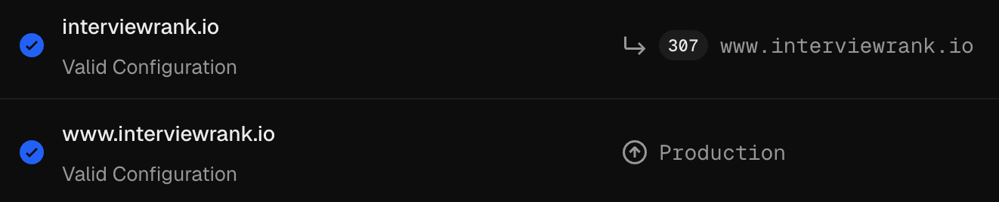

# DNS Setup (Namecheap + Vercel)

How to connect `interviewrank.io` and subdomains to Vercel projects.

---

## Overview

| Domain | Vercel Project | Purpose |
|--------|---------------|---------|
| `interviewrank.io` | Frontend (interviewrank) | Main site |
| `www.interviewrank.io` | Frontend (interviewrank) | Main site |
| `api.interviewrank.io` | Backend (interviewrank-api) | API |

---

## Setup (Vercel Nameservers)

Using Vercel nameservers is the simplest approach—Vercel manages all DNS for the domain.

### 1. Add domains in Vercel

**Frontend project:**
- Settings → Domains → Add `interviewrank.io`, `www.interviewrank.io`

**Backend project:**
- Settings → Domains → Add `api.interviewrank.io`
- The DNS record for `api.interviewrank.io` is created automatically by Vercel (no manual record needed)

### 2. Configure Namecheap

1. Namecheap → Domain List → Manage `interviewrank.io`
2. Domain tab → Nameservers → **Custom DNS**
3. Set:
   - `ns1.vercel-dns.com`
   - `ns2.vercel-dns.com`
4. Save

### 3. Verify

- Vercel will auto-create DNS records for all subdomains added to projects
- No A/CNAME records needed in Namecheap when using Vercel nameservers
- Propagation: typically 15–30 minutes, up to 24–48 hours

When configured correctly, both domains show **Valid Configuration** in Vercel. The apex domain (`interviewrank.io`) redirects (307) to the canonical `www` subdomain, which serves the production deployment:

---

## Alternative: Namecheap Advanced DNS

If keeping Namecheap's default nameservers, add these in **Advanced DNS**:

| Type | Name | Value |
|------|------|-------|
| A | `@` | `64.68.64.68` |
| CNAME | `www` | `cname.vercel-dns.com` |
| CNAME | `api` | `cname.vercel-dns.com` |

(Exact values may vary—check Vercel's domain setup for current records.)

---

## Notes

- Disable **Parking Page** in Namecheap before switching
- Remove any existing `www` redirect in Namecheap's Redirect Domain to avoid conflicts
- SSL certificates are issued automatically by Vercel after DNS propagates

---

## Email (Future)

You can use email from another provider (Google Workspace, Microsoft 365, Zoho, etc.) while keeping Vercel nameservers. Add the records in **Vercel**, not Namecheap—Vercel manages all DNS for the domain.

**Where:** Vercel → Project → Settings → Domains → select `interviewrank.io` → **DNS Records**

**Add:**
- **MX records** – Point to your email provider's mail servers (hostnames and priorities from the provider)
- **TXT records** – SPF, DKIM, DMARC if required by the provider

**Example (Google Workspace):**

| Type | Name | Value | Priority |
|------|------|-------|----------|
| MX | `@` | `aspmx.l.google.com` | 5 |
| MX | `@` | `alt1.aspmx.l.google.com` | 10 |
| TXT | `@` | `v=spf1 include:_spf.google.com ~all` | — |

(Exact records depend on the provider—follow their setup instructions.)
