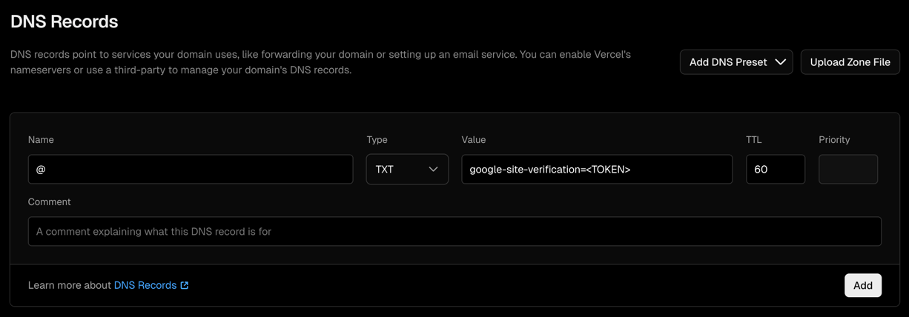

# Google Search Console Verification

- Get the verification data from [Google Search Console](https://search.google.com/search-console/not-verified?original_url=/search-console/ownership&original_resource_id).
- Since our Namecheap is configured with Vercel, we need to configure the verification data in the Vercel dashboard.
- Configure the DNS Records in [Vercel](https://vercel.com/unicore-team/~/domains/interviewrank.io).

