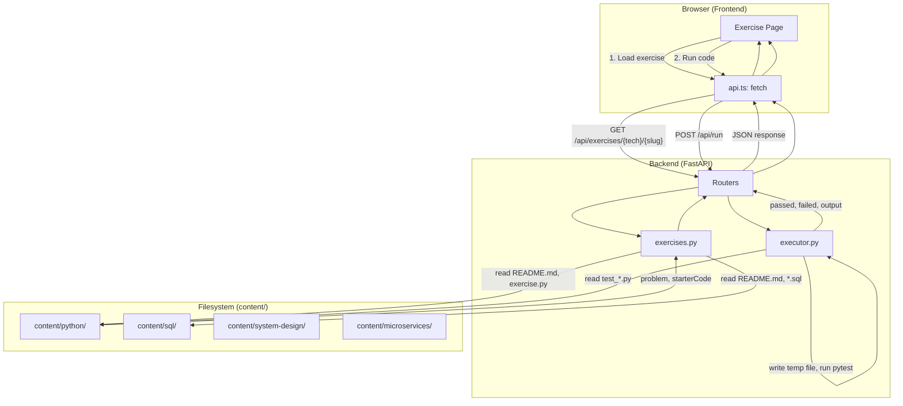

# Interview Practice Web App Plan

## About This Project

**Interview Practice** is a multi-technology interview preparation platform for learning and practicing coding, databases, and system design. The project is planned to cover:

- **Programming languages** – Python (Hello World, variables, casting, strings, etc.)
- **SQL** – Queries, joins, aggregations, and database concepts
- **System design** – Scalability, distributed systems, trade-offs
- **Microservices** – Service boundaries, API design, event-driven architecture
- **Other topics** – As the platform grows

Each exercise includes a problem statement, starter code or schema, reference solution, and automated tests. Currently, users work with exercises in their IDE. This plan outlines how to extend the project with a **LeetCode-style web application** so users can solve exercises in the browser, run tests, and submit solutions without local setup.

---

## Tech Stack

**Frontend:** Next.js + `next-mdx-remote` or `@next/mdx` for markdown rendering

- **Next.js** – React framework, API routes, file-based routing
- **next-mdx-remote** or **@next/mdx** – Render markdown from README.md files as MDX
- Keeps full control over routing and data flow
- No docs framework conventions; easier to integrate with backend API
- Problem statements (markdown) rendered alongside the code editor

---

## Project Structure

```
interview-practice/
├── content/
│   ├── python/                # Python exercises (existing)
│   ├── sql/                   # SQL exercises (planned)
│   ├── system-design/        # System design concepts (planned)
│   └── microservices/        # Microservices topics (planned)
├── backend/
│   ├── app/
│   │   ├── __init__.py
│   │   ├── main.py            # FastAPI app
│   │   ├── executor.py        # sandboxed code runner
│   │   ├── exercises.py       # load exercise metadata
│   │   └── routers/
│   │       └── run.py         # POST /run, /submit
│   ├── requirements.txt
│   └── Dockerfile
│
├── frontend/
│   ├── src/
│   │   ├── components/
│   │   │   ├── CodeEditor.tsx
│   │   │   ├── MDXContent.tsx      # Renders markdown via next-mdx-remote
│   │   │   ├── ProblemView.tsx
│   │   │   ├── ResultPanel.tsx
│   │   │   └── RunButton.tsx
│   │   ├── pages/
│   │   │   ├── index.tsx
│   │   │   └── exercise/[tech]/[slug].tsx
│   │   ├── hooks/
│   │   │   └── useRunCode.ts
│   │   └── lib/
│   │       ├── api.ts
│   │       └── mdx.ts              # MDX compile options
│   ├── package.json
│   └── next.config.js
│
├── requirements.txt
└── README.md
```

---

## Data Flow: How Frontend and Backend Access Exercises

**Backend** runs on the server and has **direct filesystem access** to the exercise directories. The frontend **never** reads files directly; it only talks to the backend API.

| Layer | Access to `content/python/`, `content/sql/`, etc. | How |
|-------|--------------------------------------------------|-----|
| **Backend** | Direct | `os.listdir`, `pathlib.Path`, `open()` |
| **Frontend** | Indirect | HTTP via `GET /api/exercises`, `GET /api/exercises/{tech}/{slug}` |

### Execution Flow

```
┌─────────────────────────────────────────────────────────────────────────────────┐
│  Browser (Frontend)                                                               │
│  ┌─────────────────────────────────────────────────────────────────────────────┐│
│  │  User visits /exercise/python/01-hello-world                                 ││
│  │  User edits code in Monaco, clicks Run                                       ││
│  └─────────────────────────────────────────────────────────────────────────────┘│
└─────────────────────────────────────────────────────────────────────────────────┘
         │
         │ 1. GET /api/exercises/python/01-hello-world
         │    → Returns { problem, starterCode, ... }
         │
         │ 2. POST /api/run { tech, slug, code }
         │    → Returns { passed, failed, output, errors }
         ▼
┌─────────────────────────────────────────────────────────────────────────────────┐
│  Backend (FastAPI)                                                               │
│  ┌─────────────────────────────────────────────────────────────────────────────┐│
│  │  exercises.py: scans content/python/, content/sql/, etc. via pathlib         ││
│  │  run router: receives code → executor → writes temp file → runs tests        ││
│  └─────────────────────────────────────────────────────────────────────────────┘│
└─────────────────────────────────────────────────────────────────────────────────┘
         │
         │ 3. Read files from disk
         │    content/python/01-hello-world/README.md
         │    content/python/01-hello-world/exercise.py
         │    content/python/01-hello-world/test_*.py
         ▼
┌─────────────────────────────────────────────────────────────────────────────────┐
│  Filesystem (repo root)                                                           │
│  content/python/  content/sql/  content/system-design/  content/microservices/    │
│  └── 01-hello-world/                                                             │
│      ├── README.md                                                                │
│      ├── exercise.py                                                              │
│      ├── solution.py                                                              │
│      └── test_*.py                                                                │
└─────────────────────────────────────────────────────────────────────────────────┘
```

### Deployment Note

The backend must run with the exercise directories mounted or available. For local dev, `backend` runs from the project root and uses `../content/` (or a configurable `CONTENT_ROOT`). For Docker, mount the repo root:

```yaml
volumes:
  - .:/app/exercises:ro
```

### Mermaid Diagram



---

## Backend API

### `GET /api/exercises`

**Response:** List of exercises with metadata (filterable by technology)

```json
[
  { "tech": "python", "slug": "01-hello-world", "title": "Hello World", "difficulty": "easy" },
  { "tech": "python", "slug": "02-variables", "title": "Variables", "difficulty": "easy" },
  { "tech": "sql", "slug": "01_select_basics", "title": "SELECT Basics", "difficulty": "easy" },
  ...
]
```

### `GET /api/exercises/{tech}/{slug}`

**Response:** Full exercise details

- Problem text (from README.md)
- Starter code (from exercise.py, .sql, or schema)
- Examples (from README tables)
- Technology-specific runner (Python pytest, SQL validator, etc.)

### `POST /api/run`

**Request:**

```json
{ "tech": "python", "slug": "01-hello-world", "code": "def hello_world(): ..." }
```

**Response:**

```json
{ "passed": 2, "failed": 0, "output": "...", "errors": [] }
```

---

## Implementation Flow

1. **Backend:** FastAPI app that:
   - Scans the `content/python/`, `content/sql/`, etc. directories for exercise folders
   - Writes user code to a temp file
   - Runs the appropriate executor per technology (pytest for Python, SQL validator for SQL, etc.)
   - Parses output and returns structured test results

2. **Frontend:** Next.js app with:
   - Exercise list on `/` (filterable by technology)
   - Exercise page at `/exercise/python/01-hello-world` or `/exercise/sql/01_select_basics`
   - Problem text rendered from README markdown via `next-mdx-remote` or `@next/mdx`
   - Monaco Editor for code editing (SQL, Python, etc.)
   - Run and Submit buttons that call `/api/run`

3. **Sandboxing:** Use `subprocess` with:
   - `timeout` (e.g. 10 seconds)
   - Optional `resource` limits
   - Or run in Docker for stronger isolation

---

## Files to Create

| File | Purpose |
|------|---------|
| `backend/app/main.py` | FastAPI app, CORS |
| `backend/app/executor.py` | Orchestrator: dispatch to tech-specific executor |
| `backend/app/exercises.py` | Parse READMEs, load starter code (tech-agnostic) |
| `backend/app/executors/` | Python executor, SQL executor, etc. |
| `backend/app/routers/run.py` | POST /run endpoint |
| `frontend/package.json` | Dependencies (next, @monaco-editor/react, next-mdx-remote) |
| `frontend/src/pages/index.tsx` | Exercise list (by technology) |
| `frontend/src/pages/exercise/[tech]/[slug].tsx` | Problem + editor + run |
| `frontend/src/components/CodeEditor.tsx` | Monaco wrapper |
| `frontend/src/components/MDXContent.tsx` | Renders markdown from README.md |
| `frontend/src/lib/api.ts` | Fetch wrapper |
| `frontend/src/lib/mdx.ts` | MDX compile/serialize config |

---

## Dependencies

**Backend:** `fastapi`, `uvicorn`, `pytest` (already in project)

**Frontend:** `next`, `react`, `react-dom`, `@monaco-editor/react`, `next-mdx-remote` (or `@next/mdx`), `remark-gfm` (for GitHub-flavored markdown tables)
